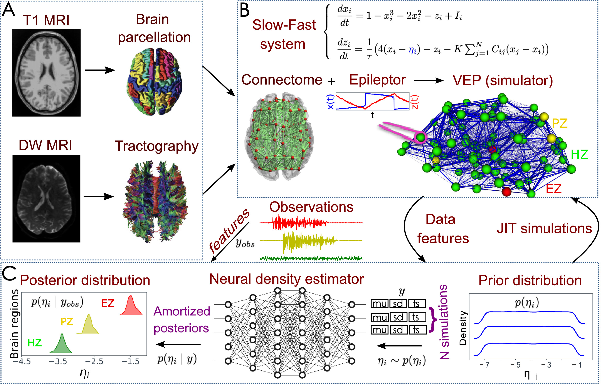

# Virtual Epileptic Patient (VEP)

## Introduction / Objective
Success rates of Epilepsy surgery in patients with drug-resistant Epilepsy has remained about 60% for the past decade. In order to improve the success rates of the surgeries better methods are necessary for pre-surgical estimation of the pathological brain regions. The VEP model aims to provide a model driven diagnostic solution by combining dynamical systems with statistical and machine learning methods which can help clinicians better identify pathological brain regions in Epilepsy.

## Overview

This repository provides a end-to-end Bayesian framework to build personalized virtual brain models of Epileptic patients from multimodal neural datasets such as diffusion MRI images and Stereotactic EEG time series recordings.  The VEP framework mainly consists of three parts:
1. Preprocessing data and extracting robust and relevant features from the SEEG time series data.
2. Defining statistical models of the time series using existing mathematical models of Epilepsy dynamics called [Epileptor](https://www.jneurosci.org/content/34/45/15009?utm_source=TrendMD&utm_medium=cpc&utm_campaign=JNeurosci_TrendMD_0) to constrain the latent state transition probabilities.
3. Performing Bayesian model inversion to estimate parameters of the Epileptor model using statistical and machine learning techniques such as:
     - Variational Inference using classical Gaussian approximations and deep learning based neural density estimators such as Normalizing Flows, Masked Autoregressive Flows (MAF), Free-form Jacobian of Reversible Dynamics (FFJORD)
     - Markov Chain Monte Carlo (MCMC) based sampling methods like Hamiltonian Monte Carlo (HMC) and No-U-Turn saampler (NUTS)
     - Maximum a posteriori (MAP) estimation using optimization techniques such as L-BFGS and ADAM.

## Model Variants

Various models provided in this repository are organized in different branches as follows:
### Neural Mass Model
The [nfvi_nmm](https://github.com/dhrunia/infr_szr_prpgtn/tree/nfvi_nmm) branch implements neural mass variant of 2D Epileptor model.

- [nmm.py](https://github.com/dhrunia/infr_szr_prpgtn/blob/nfvi_nmm/lib/model/nmm.py) contains the implmentation of statistical model in TensorFlow.
- [nfvi_2depileptor_with_eulerstep_customop.py](https://github.com/dhrunia/infr_szr_prpgtn/blob/nfvi_nmm/nfvi_2depileptor_with_eulerstep_customop.py) implements variational inference with a neural density estimator called Masked Autoregressive Flows.
- [nfvi_nmm/map_2depileptor_nmm.py](https://github.com/dhrunia/infr_szr_prpgtn/blob/nfvi_nmm/map_2depileptor_nmm.py) provides MAP estimates of the posterior density of neural mass model parameters.

### Neural Field Model
The [neural_fields](https://github.com/dhrunia/infr_szr_prpgtn/tree/neural_fields) branch implements neural field extension of 2D Epileptor model.

> **NOTE**: Neural field models are computationally very expensive to perform simulation which makes computing gradients for variational inference infeasible. To address this, Spherical Harmonic Transforms are used to improve computational performance thereby allowing use of automatic differentiation for computing gradients.

- [neuralfield.py](https://github.com/dhrunia/infr_szr_prpgtn/blob/neural_fields/lib/model/neuralfield.py) provides implementation of Neural Field model in TensorFlow.
- [mafvi_2dep_nf_mode_space.py](https://github.com/dhrunia/infr_szr_prpgtn/blob/neural_fields/mafvi_2dep_nf_mode_space.py) provides variational inference using Masekd Autoregressive Flows.
- [ffjord_vi_2depileptor_with_eulerstep_customop.py](https://github.com/dhrunia/infr_szr_prpgtn/blob/neural_fields/ffjord_vi_2depileptor_with_eulerstep_customop.py) provides variational inference using FFJORD.
- [gaussvi_2dep_nf_mode_space.py](https://github.com/dhrunia/infr_szr_prpgtn/blob/neural_fields/gaussvi_2dep_nf_mode_space.py) provides variational inference with Gaussian distribution as variational approximation.
- [map_2dep_nf_mode_space.py](https://github.com/dhrunia/infr_szr_prpgtn/blob/neural_fields/map_2dep_nf_mode_space.py) provides MAP estimation of the posterior density over parameters of neural field Epileptor model for a given SEEG dataset.

## References

- Vattikonda, A.N., Hashemi, M., Sip, V., Woodman, M.M., Bartolomei, F. and Jirsa, V.K., 2021. Identifying spatio-temporal seizure propagation patterns in epilepsy using Bayesian inference. Communications biology, 4(1), p.1244.
- Hashemi, M., Vattikonda, A.N., Sip, V., Guye, M., Bartolomei, F., Woodman, M.M. and Jirsa, V.K., 2020. The Bayesian Virtual Epileptic Patient: A probabilistic framework designed to infer the spatial map of epileptogenicity in a personalized large-scale brain model of epilepsy spread. NeuroImage, 217, p.116839.
- Jha, J., Hashemi, M., Vattikonda, A.N., Wang, H. and Jirsa, V., 2022. Fully Bayesian estimation of virtual brain parameters with self-tuning Hamiltonian Monte Carlo. Machine Learning: Science and Technology, 3(3), p.035016.
- Hashemi, M., Vattikonda, A.N., Jha, J., Sip, V., Woodman, M.M., Bartolomei, F. and Jirsa, V.K., 2023. Amortized Bayesian inference on generative dynamical network models of epilepsy using deep neural density estimators. Neural Networks, 163, pp.178-194.